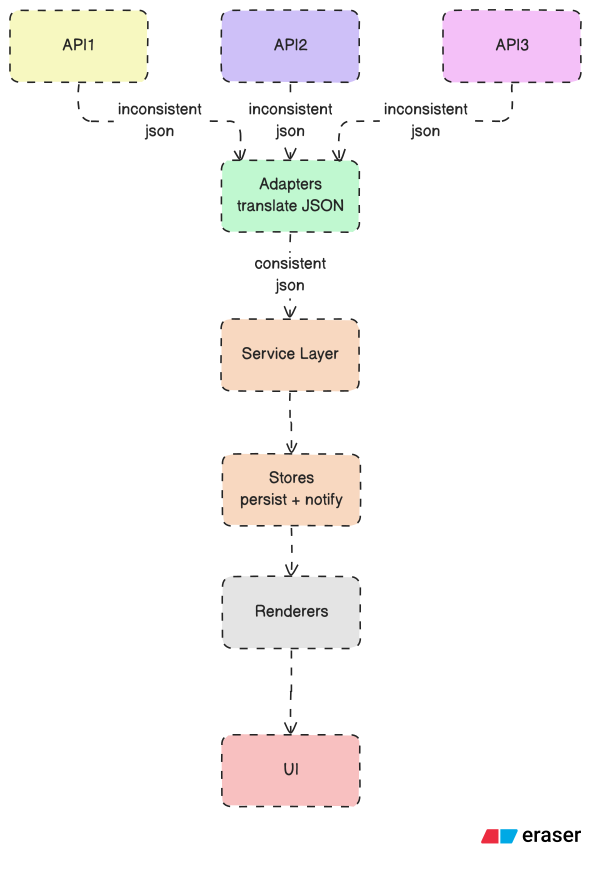

# Diagram
## 1. Application Architecture

<p align="center" style="margin: 0;">
  
</p>


## 2. API Integration using Adapters
<p align="center" style="margin: 0;">
  
</p>

# Feature

## 1. Widget Management Feature

Widgets are defined using a strongly typed **`Widget`** model that includes **API configuration**, **selected fields**, and **view-specific options**. All widget instances are managed through a **centralized Zustand store** that supports **creation**, **removal**, **layout adjustment**, and **reconfiguration**, allowing widgets to be **persisted** and **edited** independently of the UI.

## 2. Factory + Adapter pattern–based integration layer (Internally normalized, API-isolated design)

**Adapters normalize data**  
**Renderers shape it**  
**Views only display it**

The dashboard uses a **Factory + Adapter pattern** to normalize diverse financial API responses into a consistent internal format, enabling **scalable**, **extensible**, and **API-agnostic** widget rendering.

### Why This Approach Is Scalable

**Open–Closed Principle**: New APIs can be added by introducing new **adapters** without modifying existing code

**Single Responsibility**: Each **adapter** handles only one API shape

**Extensibility**: Multiple endpoints per provider are supported via **adapter registries**

**Maintainability**: API changes are localized to **adapter implementations**

**Performance Friendly**: **Normalization** happens once per fetch, not per render

## 3. Data Persistence

Widget configurations and dashboard layouts are **persisted** using **browser storage** via Zustand's **`persist` middleware**.

**Cached API responses** and widget state allow the dashboard to recover fully on **page refresh** or **browser restart**.

The application **restores widgets**, **layout**, and **polling state** automatically after reload.

Dashboard configurations can be **exported** and **imported** using service-layer utilities that interact with the **layout store**.

**Import/export functionality** enables configuration **backup** and **portability** across sessions.

## 4. Caching Strategy (Fetch once. Reuse smartly. Refresh only when needed.)

The dashboard uses a **TTL-based** client-side **caching system** with **request deduplication** to optimize API usage during **real-time polling**, ensuring efficient data fetching while respecting **rate limits**.

```
Widget Polling
     ↓
API Client (with cache & retry)
     ↓
Adapter Factory (normalization)
     ↓
Zustand Data Store
     ↓
UI Widgets
```

## 5. Efficiency and Optimization of Algorithms

We have implemented **map-based O(1) lookups** for card rendering, which allows us to avoid latency significantly. By using **hash maps** for data retrieval instead of linear searches, the dashboard can instantly access widget data regardless of the dataset size, ensuring **constant-time performance** and a **smooth user experience** even with multiple widgets polling simultaneously.
